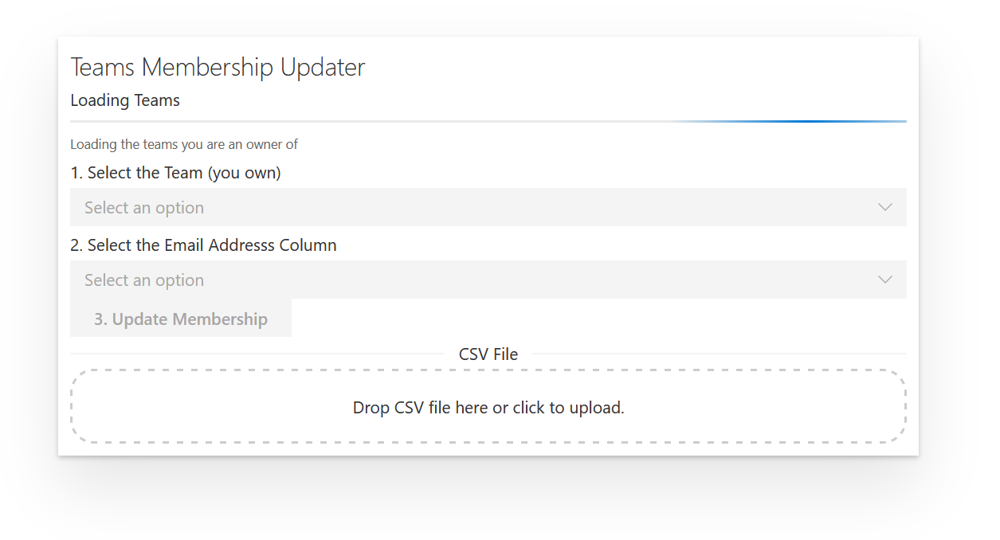

<style>
img[alt$=">"] {
  float:right;
}
</style>


## Teams Membership Updater



This is a Sharepoint Framework Web Part, you should have SFPx tools installed to build this.

Proposed to be located in the Cloud Services Team Sharepoint Site


### Building the code

```bash
git clone the repo
npm i
npm i -g gulp
gulp
```

This package produces the following:

* lib/* - intermediate-stage commonjs build artifacts
* dist/* - the bundled script, along with other resources
* deploy/* - all resources which should be uploaded to a CDN.

### Build options

gulp clean - TODO
gulp test - TODO
gulp serve - TODO
gulp bundle - TODO
gulp package-solution - TODO
