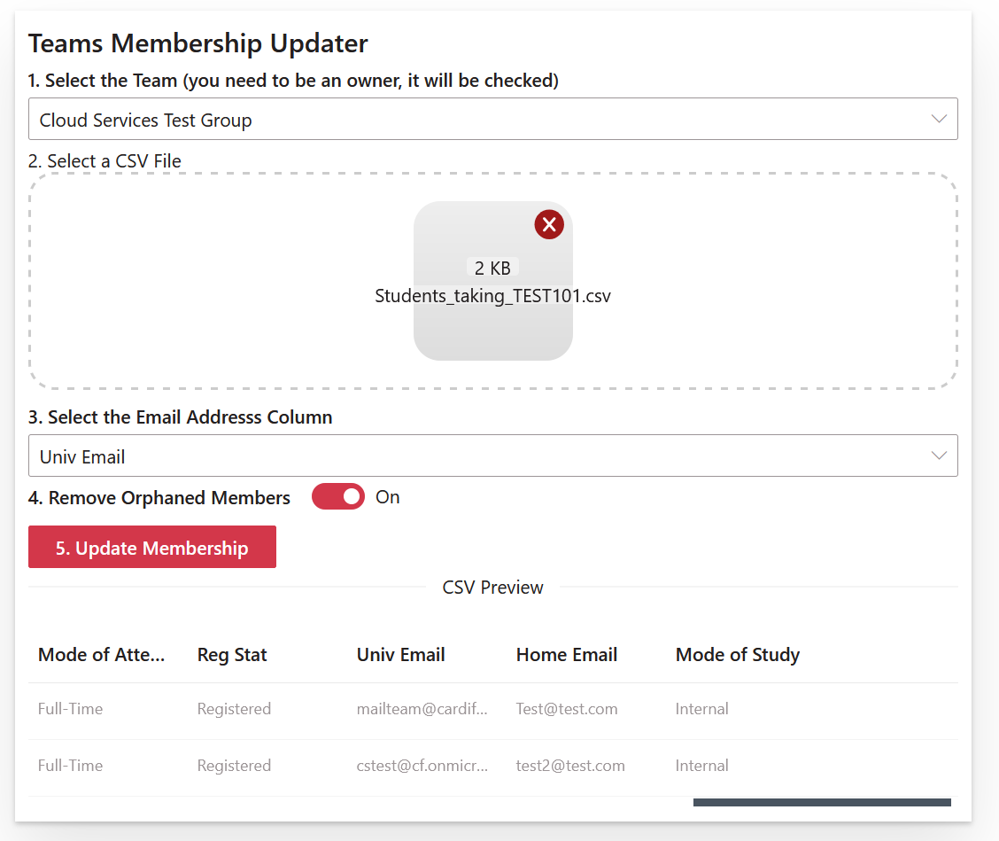

<style>
img[alt$=">"] {
  float:right;
}
</style>


## Teams Membership Updater



This is a [Sharepoint Framework](https://docs.microsoft.com/en-us/sharepoint/dev/spfx/sharepoint-framework-overview) Web Part, you should have SPFx tools installed to build this.

Located in the [Cloud Services Team Sharepoint Site](https://cf.sharepoint.com/sites/cloudservicesteam/SitePages/Teams-Membership-Updater.aspx)


### Building the code

[Setup your Dev Environment](https://docs.microsoft.com/en-us/sharepoint/dev/spfx/set-up-your-development-environment)

```bash
git clone the repo
npm i
npm i -g gulp
gulp serve
```

This package produces the following:

* lib/* - intermediate-stage commonjs build artifacts
* dist/* - the bundled script, along with other resources
* deploy/* - all resources which should be uploaded to a CDN.

### Build options

```bash
gulp bundle --ship
gulp package-solution --ship
```

### Sharepoint

* go to your sharepoint app catalog and upload the pkg file
* approve the API access in sharepoint admin